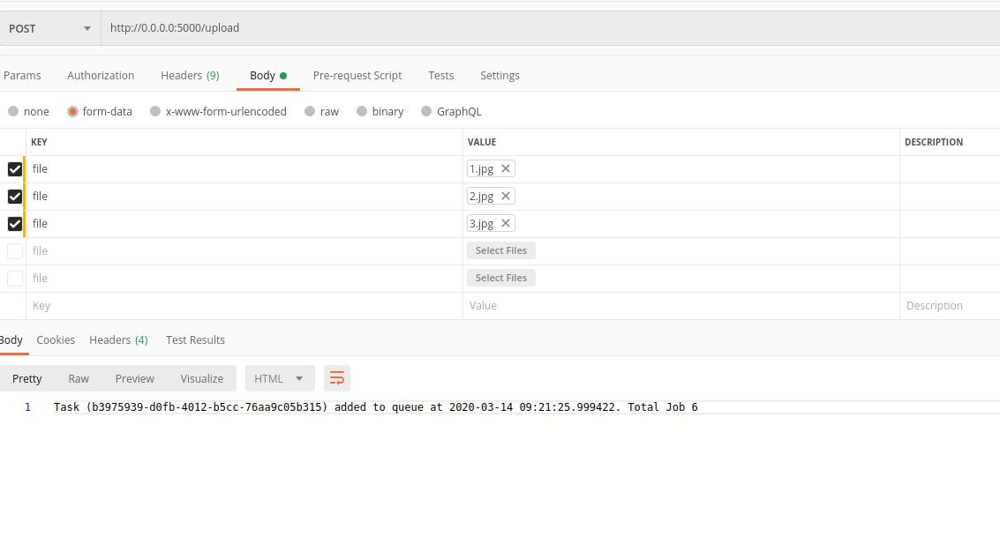

# flask-redis-rq

**To start the server**
`docker-compose up --build -d`

**To check if server is running**
`docker-compose ps`

**To check the status of the server**
- http://0.0.0.0:5000/ [Response is "Hello World" if the server is up]
- http://0.0.0.0:5000/task?n=5 [Make a mock task]
- http://0.0.0.0:5000/status?jobid=169b5625-5a35-4861-8e7b-8d1fa93535db  [Check the status of the task with *jobid*]
- http://0.0.0.0:5000/all [Response is in json format of the status of all the jobs]  install json plugin to view it better

**Postman request**

